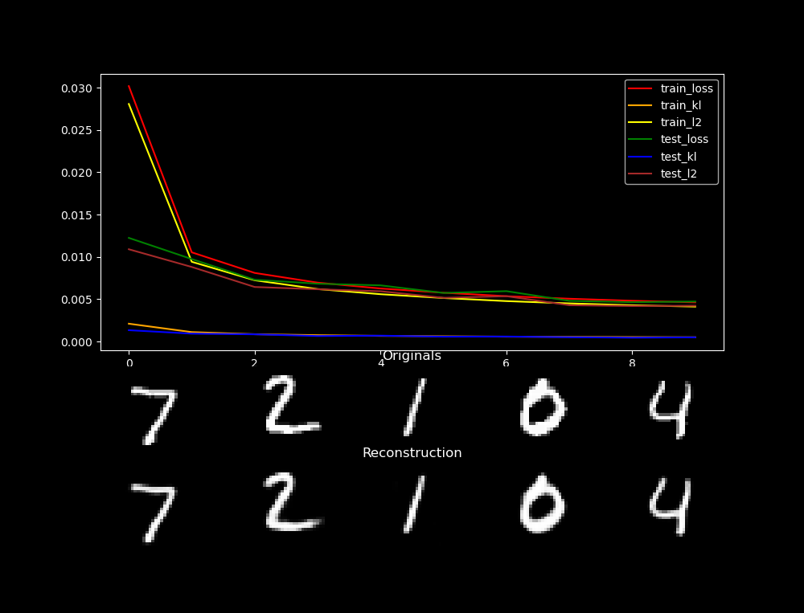
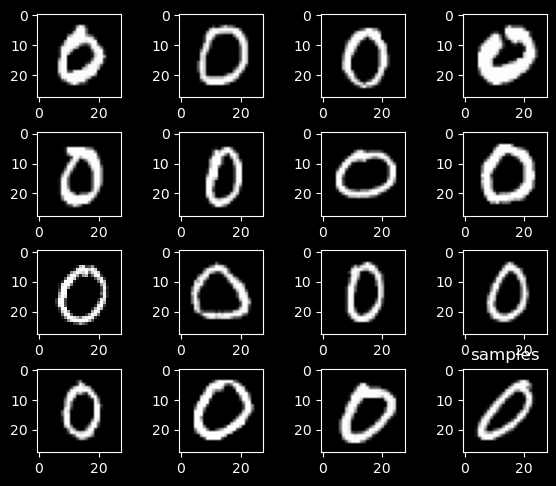
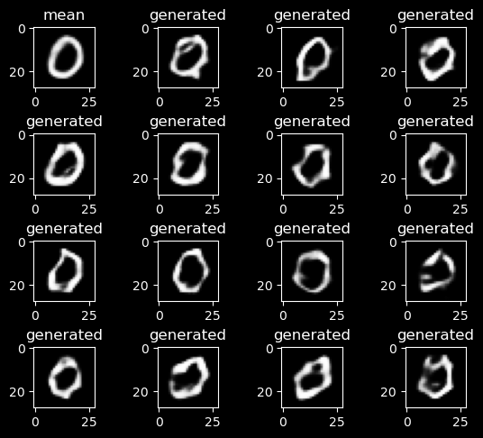
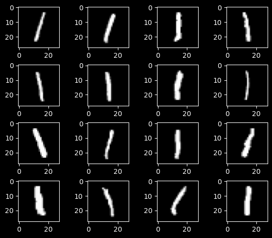
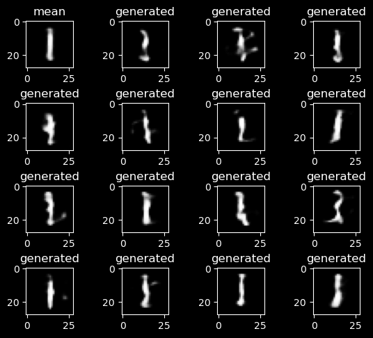
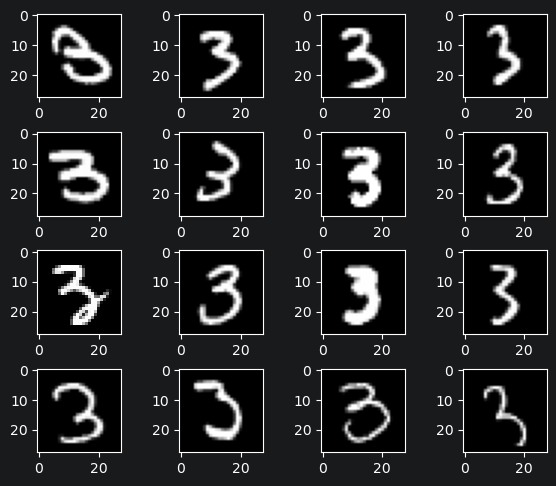
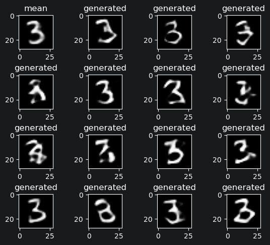

# Pyorch Variational Autoencoder

I have implemented Variational Autoencoder from scratch for learning purposes. For actual VAE implementation look:
1. https://github.com/AntixK/PyTorch-VAE
2. https://github.com/yzwxx/vae-celebA

## Training progress



## Results 

On the left: input examples used to gather the latent mean and standard deviation.
On the right: samples generated by gathered mean and std.

| Sampled 0                                    | Generated 0                                    |
|----------------------------------------------|------------------------------------------------|
|  |  | 


| Sampled 1                                    | Generated 1                                    |
|----------------------------------------------|------------------------------------------------|
|  |  | 


| Sampled 3                                    | Generated 3                                    |
|----------------------------------------------|------------------------------------------------|
|  |  | 

## My thoughts
I was planning on also training it for CelebA, but I don't want to work on this project any longer, so I will probably not do it.
The math behind autoencoders (more precisely, why they work, not how) have been the most challenging thing in my ML journey so far. 
It was especially hard for me to comprehend the original VAE paper, so I didn't use it at all, just watched youtube explanation.

## Resources
VAE walkthrough: https://www.youtube.com/watch?v=qJeaCHQ1k2w&t=832s

## Citation

```bibtex
@misc{kingma2022autoencodingvariationalbayes,
      title={Auto-Encoding Variational Bayes}, 
      author={Diederik P Kingma and Max Welling},
      year={2022},
      eprint={1312.6114},
      archivePrefix={arXiv},
      primaryClass={stat.ML},
      url={https://arxiv.org/abs/1312.6114}, 
}
```